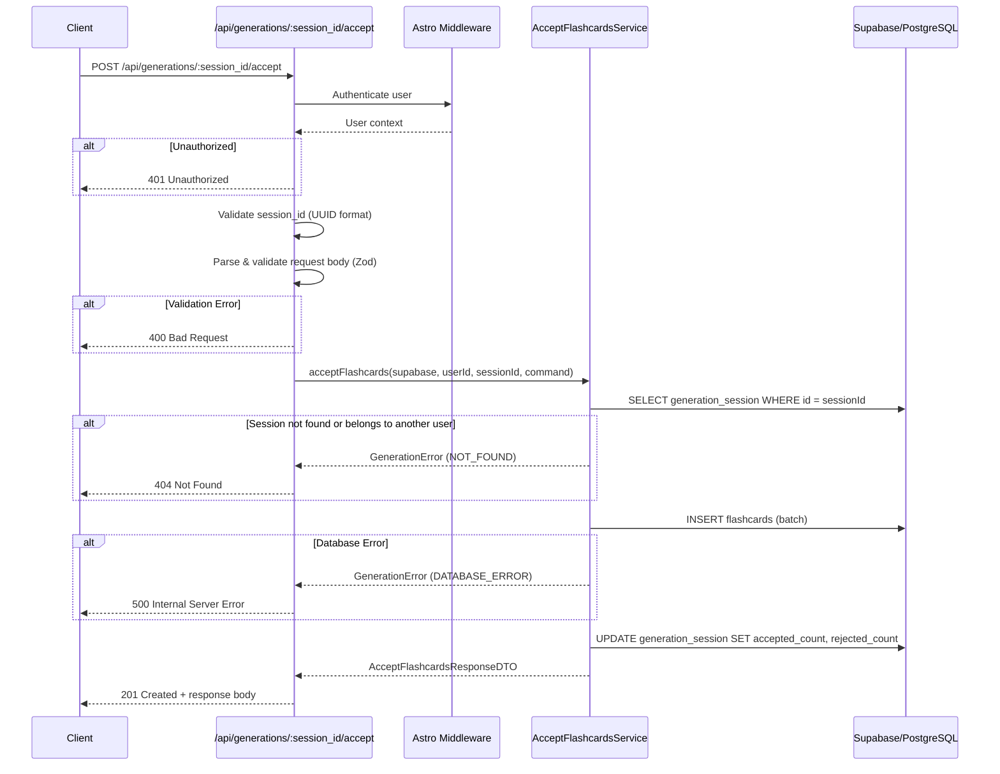

# API Endpoint Implementation Plan: Accept Generated Flashcards

## 1. Przegląd punktu końcowego

Endpoint `POST /api/generations/:session_id/accept` pozwala użytkownikowi zaakceptować wybrane sugestie fiszek wygenerowanych przez AI i zapisać je w bazie danych. Użytkownik może wcześniej edytować treść fiszek przed akceptacją. Endpoint aktualizuje również metryki sesji generowania (accepted_count, rejected_count).

**Główne funkcjonalności:**

- Przyjęcie listy zaakceptowanych fiszek (potencjalnie zedytowanych)
- Zapisanie fiszek do tabeli `flashcards` z ustawieniem `source: 'ai'`
- Aktualizacja sesji generowania o liczniki akceptacji/odrzuceń
- Zwrócenie utworzonych fiszek z ich ID

---

## 2. Szczegóły żądania

- **Metoda HTTP:** `POST`
- **Struktura URL:** `/api/generations/:session_id/accept`
- **Parametry ścieżki:**
  | Parametr | Typ | Wymagany | Opis |
  |----------|-----|----------|------|
  | `session_id` | UUID | Tak | Identyfikator sesji generowania |

- **Nagłówki:**
  - `Authorization: Bearer <access_token>` - Token JWT użytkownika
  - `Content-Type: application/json`

- **Request Body:**

```json
{
  "accepted": [
    {
      "temp_id": "temp_1",
      "front": "Generated question 1?",
      "back": "Generated answer 1"
    },
    {
      "temp_id": "temp_3",
      "front": "Edited question 3?",
      "back": "Edited answer 3"
    }
  ],
  "rejected_count": 2
}
```

**Parametry:**
| Parametr | Typ | Wymagany | Opis |
|----------|-----|----------|------|
| `accepted` | `AcceptedFlashcardDTO[]` | Tak | Lista fiszek do zaakceptowania |
| `accepted[].temp_id` | string | Tak | Tymczasowy identyfikator z generacji |
| `accepted[].front` | string | Tak | Treść pytania (max 1000 znaków) |
| `accepted[].back` | string | Tak | Treść odpowiedzi (max 5000 znaków) |
| `rejected_count` | integer | Tak | Liczba odrzuconych fiszek (>= 0) |

---

## 3. Wykorzystywane typy

### Istniejące typy z `src/types.ts`:

```typescript
// Command Model - walidacja wejścia
interface AcceptedFlashcardDTO {
  temp_id: string;
  front: string;
  back: string;
}

interface AcceptFlashcardsCommand {
  accepted: AcceptedFlashcardDTO[];
  rejected_count: number;
}

// Response DTOs
interface AcceptedFlashcardResponseDTO {
  id: string;
  front: string;
  back: string;
  source: FlashcardSource;
  generation_session_id: string;
  created_at: string;
}

interface AcceptFlashcardsResponseDTO {
  flashcards: AcceptedFlashcardResponseDTO[];
  accepted_count: number;
  rejected_count: number;
}

interface ErrorResponseDTO {
  error: {
    code: ErrorCode;
    message: string;
    details?: ErrorDetailsDTO;
  };
}
```

### Nowy Zod Schema (do utworzenia):

```typescript
// src/lib/schemas/accept-flashcards.schema.ts
import { z } from "zod";

const acceptedFlashcardSchema = z.object({
  temp_id: z.string().min(1, "Identyfikator tymczasowy jest wymagany"),
  front: z
    .string({ required_error: "Treść pytania jest wymagana" })
    .min(1, "Treść pytania nie może być pusta")
    .max(1000, "Treść pytania nie może przekraczać 1000 znaków"),
  back: z
    .string({ required_error: "Treść odpowiedzi jest wymagana" })
    .min(1, "Treść odpowiedzi nie może być pusta")
    .max(5000, "Treść odpowiedzi nie może przekraczać 5000 znaków"),
});

export const acceptFlashcardsSchema = z.object({
  accepted: z.array(acceptedFlashcardSchema).min(0, "Lista zaakceptowanych fiszek musi być tablicą"),
  rejected_count: z
    .number({ required_error: "Liczba odrzuconych fiszek jest wymagana" })
    .int("Liczba odrzuconych musi być liczbą całkowitą")
    .min(0, "Liczba odrzuconych nie może być ujemna"),
});

export type AcceptFlashcardsInput = z.infer<typeof acceptFlashcardsSchema>;
```

---

## 4. Szczegóły odpowiedzi

### Sukces (201 Created):

```json
{
  "flashcards": [
    {
      "id": "uuid",
      "front": "Generated question 1?",
      "back": "Generated answer 1",
      "source": "ai",
      "generation_session_id": "session_uuid",
      "created_at": "2024-01-01T00:00:00Z"
    },
    {
      "id": "uuid",
      "front": "Edited question 3?",
      "back": "Edited answer 3",
      "source": "ai",
      "generation_session_id": "session_uuid",
      "created_at": "2024-01-01T00:00:00Z"
    }
  ],
  "accepted_count": 2,
  "rejected_count": 2
}
```

### Kody statusu:

| Status                      | Opis                                                            |
| --------------------------- | --------------------------------------------------------------- |
| `201 Created`               | Fiszki zostały pomyślnie utworzone                              |
| `400 Bad Request`           | Nieprawidłowe dane wejściowe (walidacja)                        |
| `401 Unauthorized`          | Brak autoryzacji użytkownika                                    |
| `404 Not Found`             | Sesja generowania nie istnieje lub należy do innego użytkownika |
| `500 Internal Server Error` | Błąd bazy danych lub nieoczekiwany błąd serwera                 |

---

## 5. Przepływ danych



### Kroki przepływu:

1. **Autentykacja** - Pobierz użytkownika z `locals.supabase.auth.getUser()`
2. **Walidacja parametru URL** - Sprawdź czy `session_id` jest poprawnym UUID
3. **Parsowanie body** - Parsuj JSON i waliduj schematem Zod
4. **Weryfikacja sesji** - Sprawdź czy sesja istnieje i należy do użytkownika
5. **Zapis fiszek** - Batch insert do tabeli `flashcards`
6. **Aktualizacja metryki** - Update `accepted_count` i `rejected_count` w sesji
7. **Zwrócenie odpowiedzi** - Zwróć utworzone fiszki

---

## 6. Względy bezpieczeństwa

### 6.1. Uwierzytelnianie

- Weryfikacja tokenu JWT przez Supabase Auth
- Użycie `locals.supabase.auth.getUser()` (ustawione przez middleware)

### 6.2. Autoryzacja

- RLS na poziomie bazy danych zapewnia izolację danych
- Dodatkowa weryfikacja ownership sesji w service layer
- Użytkownik może akceptować fiszki tylko ze swojej sesji generowania

### 6.3. Walidacja danych

- **session_id:** Walidacja formatu UUID
- **front:** Non-empty string, max 1000 znaków
- **back:** Non-empty string, max 5000 znaków
- **temp_id:** Non-empty string
- **rejected_count:** Non-negative integer

### 6.4. Ochrona przed atakami

- Walidacja Zod chroni przed injection attacks
- Query parametrization w Supabase chroni przed SQL injection
- RLS chroni przed nieautoryzowanym dostępem do danych innych użytkowników

---

## 7. Obsługa błędów

### 7.1. Błędy walidacji (400 Bad Request)

```json
{
  "error": {
    "code": "VALIDATION_ERROR",
    "message": "Walidacja danych wejściowych nie powiodła się",
    "details": {
      "field": "accepted.0.front",
      "reason": "Treść pytania nie może przekraczać 1000 znaków"
    }
  }
}
```

**Scenariusze:**

- Nieprawidłowy format JSON
- Nieprawidłowy format UUID dla `session_id`
- Brakujące wymagane pola
- Przekroczone limity długości tekstu
- `rejected_count` jest ujemny lub nie jest liczbą

### 7.2. Błędy autoryzacji (401 Unauthorized)

```json
{
  "error": {
    "code": "UNAUTHORIZED",
    "message": "Wymagana autoryzacja"
  }
}
```

**Scenariusze:**

- Brak tokenu w nagłówku Authorization
- Wygasły lub nieprawidłowy token JWT

### 7.3. Nie znaleziono zasobu (404 Not Found)

```json
{
  "error": {
    "code": "NOT_FOUND",
    "message": "Sesja generowania nie została znaleziona"
  }
}
```

**Scenariusze:**

- Sesja o podanym ID nie istnieje
- Sesja należy do innego użytkownika (RLS zwróci pusty wynik)

### 7.4. Błędy serwera (500 Internal Server Error)

```json
{
  "error": {
    "code": "INTERNAL_ERROR",
    "message": "Wystąpił błąd podczas zapisywania fiszek"
  }
}
```

**Scenariusze:**

- Błąd połączenia z bazą danych
- Naruszenie ograniczeń bazy danych
- Nieoczekiwany wyjątek

---

## 8. Rozważania dotyczące wydajności

### 8.1. Batch Insert

- Użycie pojedynczego `INSERT` dla wszystkich fiszek zamiast wielu zapytań
- Supabase `.insert()` obsługuje tablicę obiektów

### 8.2. Transakcyjność

- Operacje INSERT fiszek i UPDATE sesji powinny być atomowe
- W przypadku błędu podczas INSERT, nie aktualizuj sesji
- Rozważenie użycia transakcji Supabase (RPC) dla pełnej atomowości w przyszłości

### 8.3. Indeksy

- Istniejący indeks `idx_flashcards_user_id` optymalizuje zapytania
- `generation_session_id` ma FK constraint, co zapewnia szybkie lookup

### 8.4. Limity

- Teoretyczny limit fiszek w request: brak (ograniczony przez `generated_count` w sesji)
- W praktyce: 5-20 fiszek na generację (limit LLM response)

---

## 9. Etapy wdrożenia

### Krok 1: Utworzenie schematu walidacji Zod

**Plik:** `src/lib/schemas/accept-flashcards.schema.ts`

- Zdefiniowanie `acceptedFlashcardSchema` dla pojedynczej fiszki
- Zdefiniowanie `acceptFlashcardsSchema` dla całego request body
- Eksport typu `AcceptFlashcardsInput`

---

### Krok 2: Rozszerzenie serwisu generacji

**Plik:** `src/lib/services/generation.service.ts`

Dodanie funkcji `acceptFlashcards()`:

```typescript
export async function acceptFlashcards(
  supabase: SupabaseClient<Database>,
  userId: string,
  sessionId: string,
  command: AcceptFlashcardsInput
): Promise<AcceptFlashcardsResponseDTO>;
```

**Logika:**

1. Weryfikacja istnienia sesji i ownership (SELECT z RLS)
2. Batch insert fiszek do tabeli `flashcards`
3. Aktualizacja `accepted_count` i `rejected_count` w `generation_sessions`
4. Mapowanie wyników do `AcceptFlashcardsResponseDTO`

---

### Krok 3: Utworzenie endpointu API

**Plik:** `src/pages/api/generations/[session_id]/accept.ts`

Struktura pliku:

```typescript
import type { APIContext } from "astro";

export const prerender = false;

export async function POST({ params, request, locals }: APIContext): Promise<Response> {
  // 1. Authentication
  // 2. Validate session_id format (UUID)
  // 3. Parse and validate body
  // 4. Call service
  // 5. Return response
}
```

---

### Krok 4: Walidacja UUID session_id

Dodanie helpera do walidacji UUID:

```typescript
// src/lib/utils/uuid.ts
export function isValidUUID(value: string): boolean {
  const uuidRegex = /^[0-9a-f]{8}-[0-9a-f]{4}-[1-5][0-9a-f]{3}-[89ab][0-9a-f]{3}-[0-9a-f]{12}$/i;
  return uuidRegex.test(value);
}
```

---

## 10. Plan weryfikacji

### 10.1. Testy manualne z curl

> [!IMPORTANT]
> Projekt nie posiada automatycznych testów. Weryfikacja będzie przeprowadzona manualnie za pomocą curl.

#### Test 1: Poprawna akceptacja fiszek

```bash
# 1. Najpierw wygeneruj fiszki
curl -X POST http://localhost:4321/api/generations \
  -H "Content-Type: application/json" \
  -d '{"source_text": "'"$(python3 -c "print('A' * 1000)")"'"}'

# Zapisz session_id z odpowiedzi

# 2. Zaakceptuj fiszki
curl -X POST http://localhost:4321/api/generations/{SESSION_ID}/accept \
  -H "Content-Type: application/json" \
  -d '{
    "accepted": [
      {"temp_id": "temp_1", "front": "Pytanie 1?", "back": "Odpowiedź 1"},
      {"temp_id": "temp_2", "front": "Pytanie 2?", "back": "Odpowiedź 2"}
    ],
    "rejected_count": 1
  }'

# Oczekiwany rezultat: 201 Created z listą utworzonych fiszek
```

#### Test 2: Walidacja - nieprawidłowy session_id

```bash
curl -X POST http://localhost:4321/api/generations/invalid-uuid/accept \
  -H "Content-Type: application/json" \
  -d '{"accepted": [], "rejected_count": 0}'

# Oczekiwany rezultat: 400 Bad Request
```

#### Test 3: Sesja nie istnieje

```bash
curl -X POST http://localhost:4321/api/generations/00000000-0000-0000-0000-000000000000/accept \
  -H "Content-Type: application/json" \
  -d '{"accepted": [], "rejected_count": 0}'

# Oczekiwany rezultat: 404 Not Found
```

#### Test 4: Walidacja - za długi front

```bash
curl -X POST http://localhost:4321/api/generations/{SESSION_ID}/accept \
  -H "Content-Type: application/json" \
  -d '{
    "accepted": [{"temp_id": "1", "front": "'"$(python3 -c "print('A' * 1001)")"'", "back": "ok"}],
    "rejected_count": 0
  }'

# Oczekiwany rezultat: 400 Bad Request z informacją o max 1000 znaków
```

#### Test 5: Pusta lista accepted (edge case)

```bash
curl -X POST http://localhost:4321/api/generations/{SESSION_ID}/accept \
  -H "Content-Type: application/json" \
  -d '{"accepted": [], "rejected_count": 5}'

# Oczekiwany rezultat: 201 Created z pustą listą flashcards
```

### 10.2. Weryfikacja bazy danych

Po wykonaniu testów sprawdzić w Supabase:

1. **Tabela `flashcards`:**
   - Nowe rekordy z `source = 'ai'`
   - Poprawne `generation_session_id`
   - Poprawne `user_id`

2. **Tabela `generation_sessions`:**
   - Zaktualizowane `accepted_count`
   - Zaktualizowane `rejected_count`

---

## 11. Podsumowanie plików do utworzenia/modyfikacji

| Plik                                               | Akcja              | Opis                                 |
| -------------------------------------------------- | ------------------ | ------------------------------------ |
| `src/lib/schemas/accept-flashcards.schema.ts`      | NOWY               | Schema walidacji Zod                 |
| `src/lib/services/generation.service.ts`           | MODYFIKACJA        | Dodanie funkcji `acceptFlashcards()` |
| `src/pages/api/generations/[session_id]/accept.ts` | NOWY               | Endpoint API                         |
| `src/lib/utils/uuid.ts`                            | NOWY (opcjonalnie) | Helper do walidacji UUID             |
