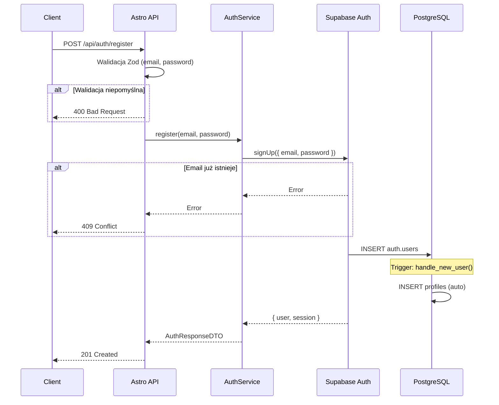
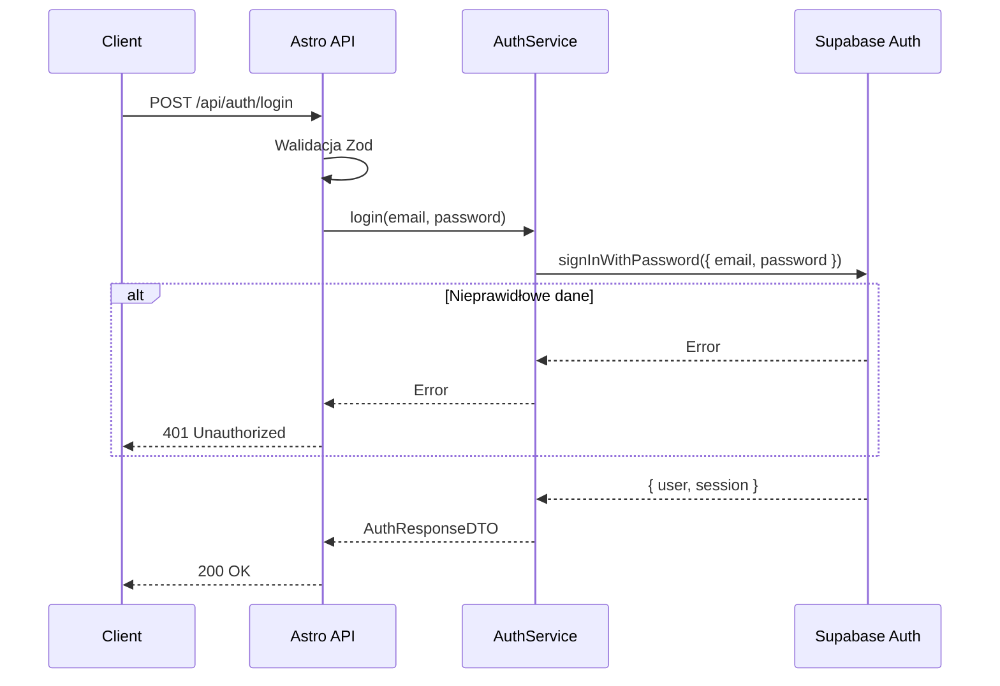
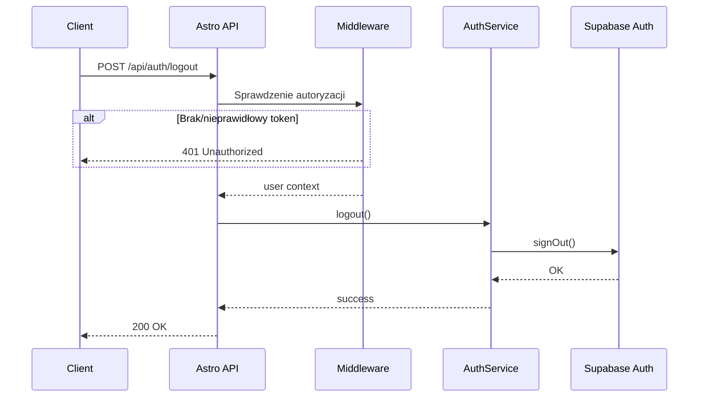
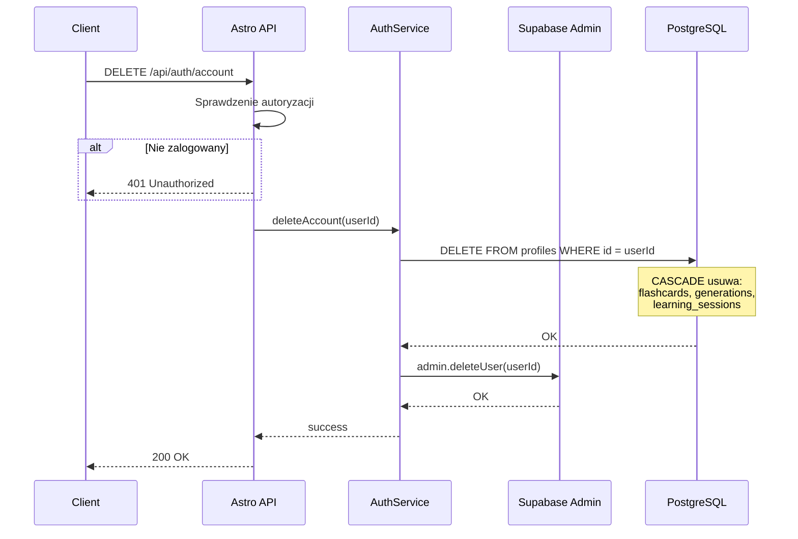

# API Endpoint Implementation Plan: Authentication (`/api/auth`)

## 1. Przegląd punktu końcowego

Endpointy uwierzytelniania zapewniają zarządzanie tożsamością użytkownika w aplikacji 10x-cards. Obejmują rejestrację, logowanie, wylogowanie oraz usuwanie konta zgodnie z wymaganiami GDPR. Implementacja wykorzystuje Supabase Auth jako backend uwierzytelniania, z warstwą API zapewniającą spójny interfejs REST.

Endpoint składa się z czterech operacji:

- **POST `/api/auth/register`** – rejestracja nowego użytkownika
- **POST `/api/auth/login`** – logowanie istniejącego użytkownika
- **POST `/api/auth/logout`** – wylogowanie aktualnej sesji
- **DELETE `/api/auth/account`** – usunięcie konta i wszystkich danych użytkownika

---

## 2. Szczegóły żądania

### 2.1. POST `/api/auth/register`

| Element         | Wartość                          |
| --------------- | -------------------------------- |
| **Metoda HTTP** | POST                             |
| **URL**         | `/api/auth/register`             |
| **Nagłówki**    | `Content-Type: application/json` |
| **Autoryzacja** | Nie wymagana                     |

**Request Body:**

```json
{
  "email": "user@example.com",
  "password": "securePassword123"
}
```

**Parametry:**

| Parametr   | Typ    | Wymagany | Walidacja                    |
| ---------- | ------ | -------- | ---------------------------- |
| `email`    | string | ✅       | Format email, max 255 znaków |
| `password` | string | ✅       | Min. 8 znaków                |

---

### 2.2. POST `/api/auth/login`

| Element         | Wartość                          |
| --------------- | -------------------------------- |
| **Metoda HTTP** | POST                             |
| **URL**         | `/api/auth/login`                |
| **Nagłówki**    | `Content-Type: application/json` |
| **Autoryzacja** | Nie wymagana                     |

**Request Body:**

```json
{
  "email": "user@example.com",
  "password": "securePassword123"
}
```

**Parametry:**

| Parametr   | Typ    | Wymagany | Walidacja    |
| ---------- | ------ | -------- | ------------ |
| `email`    | string | ✅       | Format email |
| `password` | string | ✅       | Min. 1 znak  |

---

### 2.3. POST `/api/auth/logout`

| Element         | Wartość                                |
| --------------- | -------------------------------------- |
| **Metoda HTTP** | POST                                   |
| **URL**         | `/api/auth/logout`                     |
| **Nagłówki**    | `Authorization: Bearer <access_token>` |
| **Body**        | Brak                                   |

---

### 2.4. DELETE `/api/auth/account`

| Element         | Wartość                                |
| --------------- | -------------------------------------- |
| **Metoda HTTP** | DELETE                                 |
| **URL**         | `/api/auth/account`                    |
| **Nagłówki**    | `Authorization: Bearer <access_token>` |
| **Body**        | Brak                                   |

---

## 3. Wykorzystywane typy

### 3.1. Nowe typy do dodania w `src/types.ts`

```typescript
// ============================================================================
// Authentication DTOs and Commands
// ============================================================================

/**
 * Command for user registration.
 */
export interface RegisterCommand {
  email: string;
  password: string;
}

/**
 * Command for user login.
 */
export interface LoginCommand {
  email: string;
  password: string;
}

/**
 * User data returned in auth responses.
 */
export interface AuthUserDTO {
  id: string;
  email: string;
  created_at: string;
}

/**
 * Session data returned after successful authentication.
 */
export interface SessionDTO {
  access_token: string;
  refresh_token: string;
  expires_at: number;
}

/**
 * Response from register and login endpoints.
 */
export interface AuthResponseDTO {
  user: AuthUserDTO;
  session: SessionDTO;
}

/**
 * Response from logout endpoint.
 */
export interface LogoutResponseDTO {
  message: string;
}

/**
 * Response from delete account endpoint.
 */
export interface DeleteAccountResponseDTO {
  message: string;
}
```

### 3.2. Zod Schemas (`src/lib/schemas/auth.schema.ts`)

```typescript
import { z } from "zod";

export const registerSchema = z.object({
  email: z.string().email("Invalid email format").max(255, "Email must be at most 255 characters"),
  password: z
    .string()
    .min(8, "Password must be at least 8 characters")
    .max(72, "Password must be at most 72 characters"),
});

export const loginSchema = z.object({
  email: z.string().email("Invalid email format"),
  password: z.string().min(1, "Password is required"),
});

export type RegisterInput = z.infer<typeof registerSchema>;
export type LoginInput = z.infer<typeof loginSchema>;
```

---

## 4. Szczegóły odpowiedzi

### 4.1. POST `/api/auth/register` – Sukces (201 Created)

```json
{
  "user": {
    "id": "uuid",
    "email": "user@example.com",
    "created_at": "2024-01-01T00:00:00Z"
  },
  "session": {
    "access_token": "jwt_token",
    "refresh_token": "refresh_token",
    "expires_at": 1704067200
  }
}
```

### 4.2. POST `/api/auth/login` – Sukces (200 OK)

```json
{
  "user": {
    "id": "uuid",
    "email": "user@example.com"
  },
  "session": {
    "access_token": "jwt_token",
    "refresh_token": "refresh_token",
    "expires_at": 1704067200
  }
}
```

### 4.3. POST `/api/auth/logout` – Sukces (200 OK)

```json
{
  "message": "Successfully logged out"
}
```

### 4.4. DELETE `/api/auth/account` – Sukces (200 OK)

```json
{
  "message": "Account and all associated data deleted successfully"
}
```

### 4.5. Kody odpowiedzi

| Endpoint   | Sukces | Błędy         |
| ---------- | ------ | ------------- |
| `register` | 201    | 400, 409, 500 |
| `login`    | 200    | 400, 401, 500 |
| `logout`   | 200    | 401, 500      |
| `account`  | 200    | 401, 500      |

---

## 5. Przepływ danych

### 5.1. Rejestracja (`POST /api/auth/register`)



### 5.2. Logowanie (`POST /api/auth/login`)



### 5.3. Wylogowanie (`POST /api/auth/logout`)



### 5.4. Usunięcie konta (`DELETE /api/auth/account`)



---

## 6. Względy bezpieczeństwa

### 6.1. Uwierzytelnianie

- **JWT tokens:** Supabase generuje access_token (1h) i refresh_token
- **Token storage:** Klient odpowiedzialny za bezpieczne przechowywanie tokenów
- **Token validation:** Middleware waliduje tokeny przed dostępem do chronionych endpointów

### 6.2. Ochrona przed atakami

| Zagrożenie              | Mitygacja                                                |
| ----------------------- | -------------------------------------------------------- |
| **Brute-force**         | Supabase rate limiting (domyślnie włączone)              |
| **Password spray**      | Limitowanie prób logowania per IP                        |
| **Credential stuffing** | Wymóg silnego hasła (min. 8 znaków)                      |
| **Session hijacking**   | HTTPS only, httpOnly cookies                             |
| **CSRF**                | Token-based authentication (Bearer tokens)               |
| **Account enumeration** | Supabase zwraca generyczny błąd dla nieistniejących kont |

### 6.3. Walidacja danych

- Walidacja email i password za pomocą Zod przed przekazaniem do Supabase
- Sanityzacja inputu (Supabase Auth automatycznie obsługuje)
- Limit długości hasła: 72 znaki (zgodnie z bcrypt)

### 6.4. GDPR Compliance

- **DELETE `/api/auth/account`** usuwa wszystkie dane użytkownika
- Kaskadowe usuwanie przez FK constraints (`ON DELETE CASCADE`)
- Brak soft-delete – dane usuwane trwale

---

## 7. Obsługa błędów

### 7.1. Błędy walidacji (400 Bad Request)

```json
{
  "error": {
    "code": "VALIDATION_ERROR",
    "message": "Invalid input data",
    "details": {
      "field": "email",
      "reason": "Invalid email format"
    }
  }
}
```

### 7.2. Błąd autoryzacji (401 Unauthorized)

```json
{
  "error": {
    "code": "UNAUTHORIZED",
    "message": "Invalid credentials"
  }
}
```

### 7.3. Konflikt (409 Conflict)

```json
{
  "error": {
    "code": "CONFLICT",
    "message": "Email already registered"
  }
}
```

### 7.4. Błąd serwera (500 Internal Server Error)

```json
{
  "error": {
    "code": "INTERNAL_ERROR",
    "message": "An unexpected error occurred"
  }
}
```

### 7.5. Mapowanie błędów Supabase

| Supabase Error        | HTTP Status | ErrorCode           |
| --------------------- | ----------- | ------------------- |
| `invalid_credentials` | 401         | UNAUTHORIZED        |
| `email_taken`         | 409         | CONFLICT            |
| `weak_password`       | 400         | VALIDATION_ERROR    |
| `rate_limit_exceeded` | 429         | SERVICE_UNAVAILABLE |
| Internal error        | 500         | INTERNAL_ERROR      |

---

## 8. Rozważania dotyczące wydajności

### 8.1. Optymalizacje

- **Brak N+1 queries:** Operacje auth nie wymagają dodatkowych zapytań
- **Connection pooling:** Supabase SDK zarządza połączeniami
- **Trigger efficiency:** Tworzenie profilu użytkownika przez trigger (minimalizacja round-trips)

### 8.2. Caching

- Tokeny JWT cachowane po stronie klienta
- Brak server-side caching dla auth endpoints (bezpieczeństwo)

### 8.3. Rate Limiting

| Endpoint   | Limit            |
| ---------- | ---------------- |
| `register` | 10 req/min/IP    |
| `login`    | 10 req/min/IP    |
| `logout`   | 100 req/min/user |
| `account`  | 5 req/min/user   |

> **Uwaga:** Rate limiting obsługiwany przez Supabase lub konfigurowany w reverse proxy.

---

## 9. Etapy wdrożenia

### Krok 1: Dodanie typów DTO i Command

1. Edytuj `src/types.ts`
2. Dodaj sekcję `Authentication DTOs and Commands`
3. Zdefiniuj interfejsy: `RegisterCommand`, `LoginCommand`, `AuthUserDTO`, `SessionDTO`, `AuthResponseDTO`, `LogoutResponseDTO`, `DeleteAccountResponseDTO`

### Krok 2: Utworzenie schematów walidacji Zod

1. Utwórz plik `src/lib/schemas/auth.schema.ts`
2. Zdefiniuj `registerSchema` z walidacją email i password
3. Zdefiniuj `loginSchema` z podstawową walidacją
4. Eksportuj typy `RegisterInput` i `LoginInput`

### Krok 3: Utworzenie serwisu AuthService

1. Utwórz plik `src/lib/services/auth.service.ts`
2. Zaimplementuj metodę `register(supabase, data)`:
   - Wywołaj `supabase.auth.signUp()`
   - Zmapuj odpowiedź do `AuthResponseDTO`
   - Obsłuż błędy (email taken, weak password)
3. Zaimplementuj metodę `login(supabase, data)`:
   - Wywołaj `supabase.auth.signInWithPassword()`
   - Zmapuj odpowiedź do `AuthResponseDTO`
   - Obsłuż błędy autoryzacji
4. Zaimplementuj metodę `logout(supabase)`:
   - Wywołaj `supabase.auth.signOut()`
   - Zwróć sukces lub błąd
5. Zaimplementuj metodę `deleteAccount(supabase, userId)`:
   - Użyj Supabase Admin API do usunięcia użytkownika
   - RLS kaskadowo usunie dane z profiles i powiązanych tabel

### Krok 4: Utworzenie endpointu rejestracji

1. Utwórz plik `src/pages/api/auth/register.ts`
2. Zaimplementuj handler `POST`:
   - Wyłącz prerender: `export const prerender = false`
   - Pobierz body żądania
   - Waliduj input za pomocą `registerSchema`
   - Wywołaj `AuthService.register()`
   - Zwróć odpowiedź 201 lub błąd

### Krok 5: Utworzenie endpointu logowania

1. Utwórz plik `src/pages/api/auth/login.ts`
2. Zaimplementuj handler `POST`:
   - Wyłącz prerender
   - Waliduj input za pomocą `loginSchema`
   - Wywołaj `AuthService.login()`
   - Zwróć odpowiedź 200 lub błąd

### Krok 6: Utworzenie endpointu wylogowania

1. Utwórz plik `src/pages/api/auth/logout.ts`
2. Zaimplementuj handler `POST`:
   - Wyłącz prerender
   - Sprawdź autoryzację (user z `context.locals`)
   - Wywołaj `AuthService.logout()`
   - Zwróć odpowiedź 200

### Krok 7: Utworzenie endpointu usunięcia konta

1. Utwórz plik `src/pages/api/auth/account.ts`
2. Zaimplementuj handler `DELETE`:
   - Wyłącz prerender
   - Sprawdź autoryzację
   - Wywołaj `AuthService.deleteAccount()`
   - Zwróć odpowiedź 200

### Krok 8: Aktualizacja middleware

1. Zweryfikuj, że middleware w `src/middleware/index.ts` poprawnie obsługuje:
   - Parsowanie tokenu z cookie lub header
   - Ustawianie `context.locals.user` i `context.locals.supabase`
2. Upewnij się, że endpointy publiczne (`/api/auth/register`, `/api/auth/login`) nie wymagają autoryzacji

### Krok 9: Testy manualne

1. Zarejestruj nowego użytkownika za pomocą curl
2. Zaloguj się tym samym użytkownikiem
3. Wyloguj używając otrzymanego tokenu
4. Usuń konto i zweryfikuj kaskadowe usunięcie danych

### Krok 10: Dokumentacja

1. Zaktualizuj dokumentację API o przykłady curl dla każdego endpointu
2. Dodaj testy do pliku `testing-auth.md`
