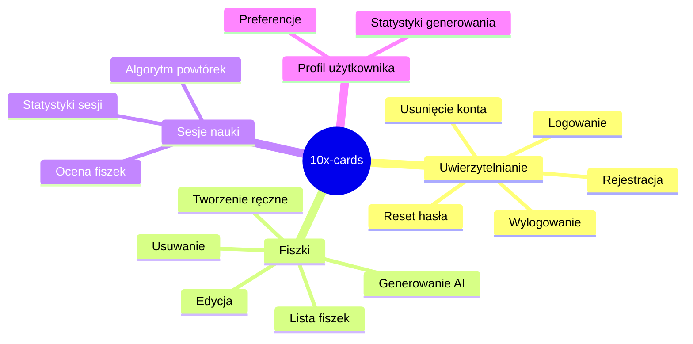
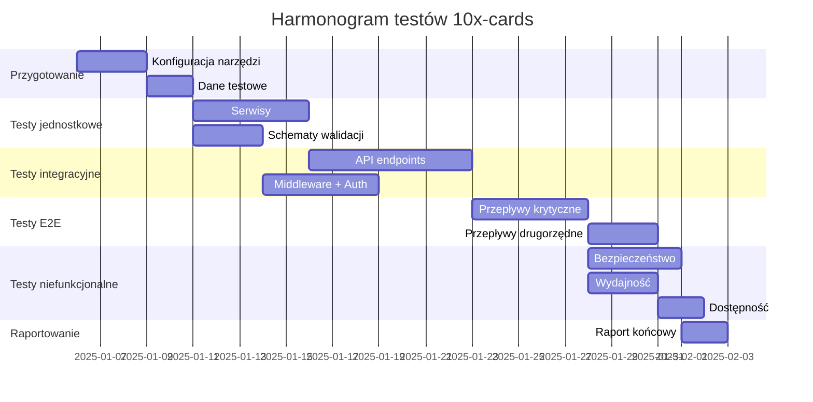
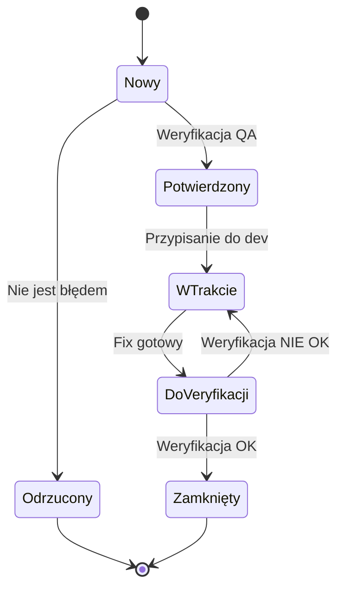

# Plan Testów – 10x-cards

## 1. Wprowadzenie i cele testowania

### 1.1. Cel dokumentu

Ten dokument definiuje kompleksową strategię testowania aplikacji 10x-cards – platformy edukacyjnej umożliwiającej tworzenie i zarządzanie fiszkami z wykorzystaniem sztucznej inteligencji oraz algorytmu spaced repetition.

### 1.2. Cele testowania

| Cel                          | Opis                                                                            | Priorytet |
| ---------------------------- | ------------------------------------------------------------------------------- | --------- |
| **Weryfikacja funkcjonalna** | Upewnienie się, że wszystkie funkcjonalności działają zgodnie z wymaganiami PRD | Krytyczny |
| **Bezpieczeństwo**           | Weryfikacja mechanizmów uwierzytelniania i autoryzacji (Supabase Auth)          | Krytyczny |
| **Integralność danych**      | Sprawdzenie poprawności operacji CRUD na fiszkach i sesjach                     | Wysoki    |
| **Integracja AI**            | Weryfikacja komunikacji z OpenRouter API                                        | Wysoki    |
| **Zgodność RODO**            | Testowanie usuwania konta i danych użytkownika                                  | Wysoki    |
| **Użyteczność**              | Walidacja UX formularzy i przepływów użytkownika                                | Średni    |
| **Wydajność**                | Sprawdzenie czasów odpowiedzi API i renderowania UI                             | Średni    |

### 1.3. Zakres projektu

Aplikacja 10x-cards składa się z następujących głównych komponentów:

- **Frontend**: Astro 5 + React 19 + TypeScript 5 + Tailwind 4 + Shadcn/ui
- **Backend**: Supabase (PostgreSQL, Auth, SDK)
- **Integracja AI**: OpenRouter API (GPT-4o-mini)
- **CI/CD**: GitHub Actions + DigitalOcean (Docker)

---

## 2. Zakres testów

### 2.1. Obszary objęte testami



### 2.2. Moduły i komponenty

| Moduł                    | Komponenty do przetestowania                                                                                      | Priorytet |
| ------------------------ | ----------------------------------------------------------------------------------------------------------------- | --------- |
| **Uwierzytelnianie**     | `LoginForm`, `RegisterForm`, `ResetPasswordForm`, `NewPasswordForm`, API auth endpoints                           | Krytyczny |
| **Generowanie fiszek**   | `GenerateView`, `GenerationForm`, `SuggestionCard`, `SuggestionsList`, `openrouter.service`, `generation.service` | Krytyczny |
| **Zarządzanie fiszkami** | `flashcard.service`, API flashcards endpoints, walidacja Zod                                                      | Wysoki    |
| **Sesje nauki**          | API learning-sessions endpoints, algorytm FSRS                                                                    | Wysoki    |
| **Middleware**           | `src/middleware/index.ts` – ochrona tras, obsługa sesji                                                           | Krytyczny |
| **Walidacja**            | Schematy Zod: `auth.schema`, `flashcard.schema`, `generation.schema`                                              | Wysoki    |

### 2.3. Elementy wyłączone z testów

- Wewnętrzna logika Supabase Auth (testowana przez dostawcę)
- Modele LLM OpenRouter (testujemy tylko integrację API)
- Biblioteki zewnętrzne (Shadcn/ui, Tailwind, React)
- Infrastruktura DigitalOcean

---

## 3. Typy testów

### 3.1. Testy jednostkowe (Unit Tests)

**Cel**: Weryfikacja pojedynczych funkcji i modułów w izolacji.

| Obszar                 | Elementy do testowania                                                                         | Narzędzie                |
| ---------------------- | ---------------------------------------------------------------------------------------------- | ------------------------ |
| **Serwisy**            | `auth.service.ts`, `flashcard.service.ts`, `generation.service.ts`, `openrouter.service.ts`    | Vitest                   |
| **Schematy walidacji** | `auth.schema.ts`, `flashcard.schema.ts`, `generation.schema.ts`, `accept-flashcards.schema.ts` | Vitest                   |
| **Utilsy**             | `src/lib/utils.ts`, `src/lib/utils/`                                                           | Vitest                   |
| **Komponenty React**   | Hooki: `src/components/hooks/`, logika stanów                                                  | Vitest + Testing Library |

**Przykładowe scenariusze testów jednostkowych:**

1. **`generation.service.ts`**:
   - Poprawne tworzenie sesji generowania
   - Obsługa błędów z OpenRouter API
   - Akceptacja fiszek z walidacją

2. **`auth.schema.ts`**:
   - Walidacja poprawnego formatu email
   - Walidacja minimalnej długości hasła (8 znaków)
   - Odrzucenie nieprawidłowych danych

3. **`openrouter.service.ts`**:
   - Parsowanie odpowiedzi JSON z LLM
   - Obsługa timeout'ów
   - Retry przy błędach 5xx

### 3.2. Testy integracyjne (Integration Tests)

**Cel**: Weryfikacja współpracy między komponentami i serwisami.

| Integracja                   | Opis                                                 | Narzędzie                          |
| ---------------------------- | ---------------------------------------------------- | ---------------------------------- |
| **API ↔ Supabase**          | Endpointy flashcards, generations, learning-sessions | Vitest + Supabase Test Helpers     |
| **Middleware ↔ Auth**       | Ochrona tras, przekierowania                         | Vitest + Mock Supabase             |
| **Frontend ↔ API**          | Formularze → Endpointy → Odpowiedzi                  | Playwright                         |
| **Generation ↔ OpenRouter** | Wysyłanie promptu, parsowanie odpowiedzi             | Vitest + MSW (Mock Service Worker) |

**Przykładowe scenariusze:**

1. **Przepływ rejestracji**:
   - Użytkownik wypełnia formularz → API `/api/auth/register` → Supabase Auth → Utworzenie profilu

2. **Przepływ generowania fiszek**:
   - Tekst źródłowy → API `/api/generations` → OpenRouter → Zapis sesji → Odpowiedź z sugestiami

3. **Akceptacja fiszek**:
   - Selekcja sugestii → API `/api/generations/:id/accept` → Zapis fiszek → Aktualizacja statystyk

### 3.3. Testy end-to-end (E2E Tests)

**Cel**: Weryfikacja pełnych przepływów użytkownika w rzeczywistym środowisku.

| Przepływ                    | Opis                                                    | Priorytet |
| --------------------------- | ------------------------------------------------------- | --------- |
| **Rejestracja → Logowanie** | Pełny cykl onboardingu                                  | Krytyczny |
| **Generowanie fiszek AI**   | Wklejenie tekstu → Generowanie → Akceptacja → Zapis     | Krytyczny |
| **Sesja nauki**             | Start sesji → Przeglądanie fiszek → Ocena → Zakończenie | Wysoki    |
| **Zarządzanie fiszkami**    | CRUD na fiszkach                                        | Wysoki    |
| **Reset hasła**             | Żądanie resetu → Email → Nowe hasło                     | Średni    |
| **Usunięcie konta**         | Potwierdzenie → Usunięcie danych → Wylogowanie          | Średni    |

**Narzędzie**: Playwright

### 3.4. Testy bezpieczeństwa

| Obszar                | Test                                  | Metoda              |
| --------------------- | ------------------------------------- | ------------------- |
| **Autoryzacja**       | Dostęp do cudzych fiszek              | Ręczne + Playwright |
| **Uwierzytelnianie**  | Brute force na login                  | OWASP ZAP           |
| **Sesje**             | Wygaśnięcie tokenów JWT               | Ręczne              |
| **Walidacja wejścia** | SQL Injection, XSS                    | OWASP ZAP           |
| **CORS**              | Nieautoryzowane requesty cross-origin | Ręczne              |
| **Rate limiting**     | Limit żądań na reset hasła            | Ręczne              |

### 3.5. Testy wydajnościowe

| Metryka                           | Cel                                        | Narzędzie  |
| --------------------------------- | ------------------------------------------ | ---------- |
| **Czas odpowiedzi API**           | < 200ms dla CRUD, < 30s dla generowania AI | k6         |
| **First Contentful Paint**        | < 1.5s                                     | Lighthouse |
| **Time to Interactive**           | < 3s                                       | Lighthouse |
| **Największe renderowanie (LCP)** | < 2.5s                                     | Lighthouse |
| **Obciążenie bazy danych**        | 100 równoczesnych użytkowników             | k6         |

### 3.6. Testy dostępności (Accessibility)

| Standard        | Elementy                                        | Narzędzie            |
| --------------- | ----------------------------------------------- | -------------------- |
| **WCAG 2.1 AA** | Kontrast, czytniki ekranu, nawigacja klawiaturą | axe-core, Lighthouse |
| **ARIA**        | Role, atrybuty aria-\*                          | axe-core             |
| **Fokus**       | Widoczność i kolejność focusa                   | Ręczne               |

---

## 4. Scenariusze testowe

### 4.1. Moduł uwierzytelniania

#### TC-AUTH-001: Rejestracja nowego użytkownika

| Pole                 | Wartość                                                                                |
| -------------------- | -------------------------------------------------------------------------------------- |
| **Warunki wstępne**  | Użytkownik nie jest zalogowany                                                         |
| **Dane testowe**     | Email: `test@example.com`, Hasło: `SecurePass123!`                                     |
| **Kroki**            | 1. Przejdź do `/register` <br> 2. Wypełnij formularz <br> 3. Kliknij "Zarejestruj się" |
| **Oczekiwany wynik** | Użytkownik zostaje zarejestrowany i przekierowany do `/generate`                       |
| **Priorytet**        | Krytyczny                                                                              |

#### TC-AUTH-002: Logowanie z poprawnymi danymi

| Pole                 | Wartość                                                                    |
| -------------------- | -------------------------------------------------------------------------- |
| **Warunki wstępne**  | Użytkownik posiada konto                                                   |
| **Dane testowe**     | Email i hasło istniejącego użytkownika                                     |
| **Kroki**            | 1. Przejdź do `/login` <br> 2. Wprowadź dane <br> 3. Kliknij "Zaloguj się" |
| **Oczekiwany wynik** | Przekierowanie do `/generate`, widoczny header z emailem                   |
| **Priorytet**        | Krytyczny                                                                  |

#### TC-AUTH-003: Logowanie z błędnymi danymi

| Pole                 | Wartość                                                                           |
| -------------------- | --------------------------------------------------------------------------------- |
| **Warunki wstępne**  | —                                                                                 |
| **Dane testowe**     | Email: `wrong@example.com`, Hasło: `wrongpass`                                    |
| **Kroki**            | 1. Przejdź do `/login` <br> 2. Wprowadź błędne dane <br> 3. Kliknij "Zaloguj się" |
| **Oczekiwany wynik** | Komunikat o nieprawidłowych danych logowania (bez ujawniania szczegółów)          |
| **Priorytet**        | Krytyczny                                                                         |

#### TC-AUTH-004: Wylogowanie

| Pole                 | Wartość                                                 |
| -------------------- | ------------------------------------------------------- |
| **Warunki wstępne**  | Użytkownik zalogowany                                   |
| **Kroki**            | 1. Kliknij przycisk wylogowania w nawigacji             |
| **Oczekiwany wynik** | Przekierowanie do `/login`, chronione trasy niedostępne |
| **Priorytet**        | Krytyczny                                               |

#### TC-AUTH-005: Reset hasła

| Pole                 | Wartość                                                                                                                                          |
| -------------------- | ------------------------------------------------------------------------------------------------------------------------------------------------ |
| **Warunki wstępne**  | Użytkownik posiada konto                                                                                                                         |
| **Dane testowe**     | Email zarejestrowanego użytkownika                                                                                                               |
| **Kroki**            | 1. Przejdź do `/auth/reset-password` <br> 2. Wprowadź email <br> 3. Kliknij "Wyślij link" <br> 4. Pobierz link z emaila <br> 5. Ustaw nowe hasło |
| **Oczekiwany wynik** | Możliwość logowania nowym hasłem                                                                                                                 |
| **Priorytet**        | Wysoki                                                                                                                                           |

#### TC-AUTH-006: Usunięcie konta (RODO)

| Pole                 | Wartość                                                                             |
| -------------------- | ----------------------------------------------------------------------------------- |
| **Warunki wstępne**  | Użytkownik zalogowany, posiada fiszki                                               |
| **Kroki**            | 1. Przejdź do ustawień konta <br> 2. Wybierz "Usuń konto" <br> 3. Potwierdź decyzję |
| **Oczekiwany wynik** | Konto usunięte, wszystkie fiszki usunięte, wylogowanie                              |
| **Priorytet**        | Wysoki                                                                              |

### 4.2. Moduł generowania fiszek AI

#### TC-GEN-001: Generowanie fiszek z poprawnym tekstem

| Pole                 | Wartość                                                                                 |
| -------------------- | --------------------------------------------------------------------------------------- |
| **Warunki wstępne**  | Użytkownik zalogowany                                                                   |
| **Dane testowe**     | Tekst o długości 1500 znaków                                                            |
| **Kroki**            | 1. Przejdź do `/generate` <br> 2. Wklej tekst źródłowy <br> 3. Kliknij "Generuj fiszki" |
| **Oczekiwany wynik** | Lista sugestii fiszek (5-15 sztuk), widoczny wskaźnik ładowania podczas generowania     |
| **Priorytet**        | Krytyczny                                                                               |

#### TC-GEN-002: Walidacja długości tekstu (za krótki)

| Pole                 | Wartość                                                            |
| -------------------- | ------------------------------------------------------------------ |
| **Warunki wstępne**  | Użytkownik zalogowany                                              |
| **Dane testowe**     | Tekst o długości 500 znaków                                        |
| **Kroki**            | 1. Wklej krótki tekst <br> 2. Sprawdź stan przycisku "Generuj"     |
| **Oczekiwany wynik** | Przycisk nieaktywny, komunikat o minimalnej długości (1000 znaków) |
| **Priorytet**        | Wysoki                                                             |

#### TC-GEN-003: Walidacja długości tekstu (za długi)

| Pole                 | Wartość                                                              |
| -------------------- | -------------------------------------------------------------------- |
| **Warunki wstępne**  | Użytkownik zalogowany                                                |
| **Dane testowe**     | Tekst o długości 12000 znaków                                        |
| **Kroki**            | 1. Wklej długi tekst <br> 2. Sprawdź stan przycisku "Generuj"        |
| **Oczekiwany wynik** | Przycisk nieaktywny, komunikat o maksymalnej długości (10000 znaków) |
| **Priorytet**        | Wysoki                                                               |

#### TC-GEN-004: Akceptacja wybranych fiszek

| Pole                 | Wartość                                                                    |
| -------------------- | -------------------------------------------------------------------------- |
| **Warunki wstępne**  | Wygenerowane sugestie fiszek                                               |
| **Kroki**            | 1. Zaznacz 3 z 5 sugestii <br> 2. Kliknij "Zapisz wybrane"                 |
| **Oczekiwany wynik** | 3 fiszki zapisane w bazie, komunikat sukcesu, aktualizacja statystyk sesji |
| **Priorytet**        | Krytyczny                                                                  |

#### TC-GEN-005: Edycja sugestii przed akceptacją

| Pole                 | Wartość                                                                                                |
| -------------------- | ------------------------------------------------------------------------------------------------------ |
| **Warunki wstępne**  | Wygenerowane sugestie fiszek                                                                           |
| **Kroki**            | 1. Kliknij edycję na sugestii <br> 2. Zmień treść przodu/tyłu <br> 3. Zaakceptuj fiszkę <br> 4. Zapisz |
| **Oczekiwany wynik** | Fiszka zapisana z edytowaną treścią                                                                    |
| **Priorytet**        | Wysoki                                                                                                 |

#### TC-GEN-006: Obsługa błędu API OpenRouter

| Pole                 | Wartość                                            |
| -------------------- | -------------------------------------------------- |
| **Warunki wstępne**  | Użytkownik zalogowany, API niedostępne (symulacja) |
| **Dane testowe**     | Poprawny tekst źródłowy                            |
| **Kroki**            | 1. Wklej tekst <br> 2. Kliknij "Generuj fiszki"    |
| **Oczekiwany wynik** | Komunikat o tymczasowej niedostępności usługi AI   |
| **Priorytet**        | Wysoki                                             |

### 4.3. Moduł zarządzania fiszkami

#### TC-FLASH-001: Lista fiszek użytkownika

| Pole                 | Wartość                               |
| -------------------- | ------------------------------------- |
| **Warunki wstępne**  | Użytkownik zalogowany, posiada fiszki |
| **Kroki**            | 1. Przejdź do widoku "Moje fiszki"    |
| **Oczekiwany wynik** | Lista fiszek użytkownika z paginacją  |
| **Priorytet**        | Wysoki                                |

#### TC-FLASH-002: Tworzenie fiszki ręcznie

| Pole                 | Wartość                                                             |
| -------------------- | ------------------------------------------------------------------- |
| **Warunki wstępne**  | Użytkownik zalogowany                                               |
| **Dane testowe**     | Przód: "Pytanie?", Tył: "Odpowiedź"                                 |
| **Kroki**            | 1. Kliknij "Dodaj fiszkę" <br> 2. Wypełnij formularz <br> 3. Zapisz |
| **Oczekiwany wynik** | Fiszka dodana z `source: manual`                                    |
| **Priorytet**        | Wysoki                                                              |

#### TC-FLASH-003: Edycja istniejącej fiszki

| Pole                 | Wartość                                                     |
| -------------------- | ----------------------------------------------------------- |
| **Warunki wstępne**  | Użytkownik posiada fiszkę                                   |
| **Kroki**            | 1. Kliknij edycję fiszki <br> 2. Zmień treść <br> 3. Zapisz |
| **Oczekiwany wynik** | Fiszka zaktualizowana, `updated_at` zmienione               |
| **Priorytet**        | Wysoki                                                      |

#### TC-FLASH-004: Usuwanie fiszki

| Pole                 | Wartość                                                 |
| -------------------- | ------------------------------------------------------- |
| **Warunki wstępne**  | Użytkownik posiada fiszkę                               |
| **Kroki**            | 1. Kliknij usuń przy fiszce <br> 2. Potwierdź usunięcie |
| **Oczekiwany wynik** | Fiszka usunięta permanentnie                            |
| **Priorytet**        | Wysoki                                                  |

#### TC-FLASH-005: Filtrowanie fiszek po źródle

| Pole                 | Wartość                                         |
| -------------------- | ----------------------------------------------- |
| **Warunki wstępne**  | Użytkownik ma fiszki z obu źródeł (AI i manual) |
| **Kroki**            | 1. Wybierz filtr "AI" <br> 2. Sprawdź listę     |
| **Oczekiwany wynik** | Wyświetlane tylko fiszki z `source: ai`         |
| **Priorytet**        | Średni                                          |

### 4.4. Moduł sesji nauki

#### TC-LEARN-001: Start sesji nauki

| Pole                 | Wartość                                                  |
| -------------------- | -------------------------------------------------------- |
| **Warunki wstępne**  | Użytkownik ma fiszki do powtórki                         |
| **Kroki**            | 1. Przejdź do "Sesja nauki" <br> 2. Kliknij "Rozpocznij" |
| **Oczekiwany wynik** | Wyświetlona pierwsza fiszka (przód)                      |
| **Priorytet**        | Wysoki                                                   |

#### TC-LEARN-002: Ocena fiszki

| Pole                 | Wartość                                                               |
| -------------------- | --------------------------------------------------------------------- |
| **Warunki wstępne**  | Trwająca sesja nauki                                                  |
| **Kroki**            | 1. Odkryj tył fiszki <br> 2. Wybierz ocenę (1-4)                      |
| **Oczekiwany wynik** | Zaktualizowany `interval` i `ease_factor`, wyświetlona kolejna fiszka |
| **Priorytet**        | Wysoki                                                                |

#### TC-LEARN-003: Zakończenie sesji

| Pole                 | Wartość                                                      |
| -------------------- | ------------------------------------------------------------ |
| **Warunki wstępne**  | Trwająca sesja nauki                                         |
| **Kroki**            | 1. Przejrzyj wszystkie fiszki lub kliknij "Zakończ"          |
| **Oczekiwany wynik** | Podsumowanie sesji: liczba przejrzanych fiszek, czas trwania |
| **Priorytet**        | Wysoki                                                       |

### 4.5. Moduł bezpieczeństwa

#### TC-SEC-001: Dostęp do cudzych fiszek

| Pole                 | Wartość                                                                  |
| -------------------- | ------------------------------------------------------------------------ |
| **Warunki wstępne**  | Dwóch użytkowników z fiszkami                                            |
| **Kroki**            | 1. Zaloguj jako User A <br> 2. Spróbuj GET `/api/flashcards/:id_usera_B` |
| **Oczekiwany wynik** | Status 404 Not Found                                                     |
| **Priorytet**        | Krytyczny                                                                |

#### TC-SEC-002: Dostęp do chronionych tras bez logowania

| Pole                 | Wartość                                |
| -------------------- | -------------------------------------- |
| **Warunki wstępne**  | Użytkownik niezalogowany               |
| **Kroki**            | 1. Przejdź bezpośrednio do `/generate` |
| **Oczekiwany wynik** | Przekierowanie do `/login`             |
| **Priorytet**        | Krytyczny                              |

#### TC-SEC-003: Wygaśnięcie tokenu JWT

| Pole                 | Wartość                                             |
| -------------------- | --------------------------------------------------- |
| **Warunki wstępne**  | Użytkownik zalogowany, token wygasł                 |
| **Kroki**            | 1. Spróbuj wykonać akcję wymagającą autoryzacji     |
| **Oczekiwany wynik** | Przekierowanie do logowania lub auto-refresh tokenu |
| **Priorytet**        | Wysoki                                              |

---

## 5. Środowisko testowe

### 5.1. Środowiska

| Środowisko                 | Cel                             | Baza danych            | OpenRouter                      |
| -------------------------- | ------------------------------- | ---------------------- | ------------------------------- |
| **Lokalne (dev)**          | Testy jednostkowe, integracyjne | Supabase local         | Mock (MSW)                      |
| **CI/CD (GitHub Actions)** | Automatyczne testy przy PR      | Supabase test instance | Mock (MSW)                      |
| **Staging**                | Testy E2E, UAT                  | Supabase staging       | Rzeczywiste API (limit budżetu) |
| **Produkcja**              | Smoke testy po deploy           | Supabase prod          | Rzeczywiste API                 |

### 5.2. Konfiguracja lokalna

```bash
# Wymagane zmienne środowiskowe
SUPABASE_URL=http://localhost:54321
SUPABASE_KEY=<local_anon_key>
OPENROUTER_API_KEY=<test_key_or_mock>

# Uruchomienie Supabase lokalnie
npx supabase start

# Uruchomienie aplikacji
npm run dev
```

### 5.3. Dane testowe

| Typ                   | Opis                             |
| --------------------- | -------------------------------- |
| **Użytkownicy**       | 3 konta testowe z różnymi rolami |
| **Fiszki**            | Zestaw 50 fiszek (AI + manual)   |
| **Sesje generowania** | 5 sesji z różnymi statystykami   |
| **Sesje nauki**       | 10 sesji z historią recenzji     |

---

## 6. Narzędzia testowe

### 6.1. Stack narzędziowy

| Kategoria                | Narzędzie                 | Uzasadnienie                                   |
| ------------------------ | ------------------------- | ---------------------------------------------- |
| **Testy jednostkowe**    | Vitest                    | Szybki, natywna obsługa ESM, TypeScript        |
| **Testy komponentów**    | Testing Library (React)   | Testowanie z perspektywy użytkownika           |
| **Testy E2E**            | Playwright                | Cross-browser, stabilny, dobra integracja z CI |
| **Mockowanie API**       | MSW (Mock Service Worker) | Intercept requestów bez modyfikacji kodu       |
| **Pokrycie kodu**        | Istanbul (via Vitest)     | Integracja z Vitest                            |
| **Testy wydajności**     | k6 + Lighthouse           | Obciążenie API + metryki web                   |
| **Testy bezpieczeństwa** | OWASP ZAP                 | Automatyczne skanowanie                        |
| **Testy dostępności**    | axe-core + Lighthouse     | Audyt WCAG                                     |
| **CI/CD**                | GitHub Actions            | Natywna integracja z repozytorium              |

### 6.2. Konfiguracja narzędzi

#### Vitest (`vitest.config.ts`)

```typescript
import { defineConfig } from "vitest/config";
import react from "@vitejs/plugin-react";

export default defineConfig({
  plugins: [react()],
  test: {
    environment: "jsdom",
    globals: true,
    setupFiles: ["./src/test/setup.ts"],
    coverage: {
      provider: "istanbul",
      reporter: ["text", "json", "html"],
      exclude: ["node_modules/", "dist/", "*.config.*"],
    },
  },
  resolve: {
    alias: {
      "@": "/src",
    },
  },
});
```

#### Playwright (`playwright.config.ts`)

```typescript
import { defineConfig, devices } from "@playwright/test";

export default defineConfig({
  testDir: "./e2e",
  fullyParallel: true,
  retries: process.env.CI ? 2 : 0,
  workers: process.env.CI ? 1 : undefined,
  reporter: "html",
  use: {
    baseURL: "http://localhost:4321",
    trace: "on-first-retry",
  },
  projects: [
    { name: "chromium", use: { ...devices["Desktop Chrome"] } },
    { name: "firefox", use: { ...devices["Desktop Firefox"] } },
    { name: "webkit", use: { ...devices["Desktop Safari"] } },
  ],
  webServer: {
    command: "npm run dev",
    url: "http://localhost:4321",
    reuseExistingServer: !process.env.CI,
  },
});
```

---

## 7. Harmonogram testów

### 7.1. Fazy testowania



### 7.2. Estymacja czasowa

| Faza                     | Czas (dni robocze) |
| ------------------------ | ------------------ |
| Przygotowanie środowiska | 5                  |
| Testy jednostkowe        | 8                  |
| Testy integracyjne       | 12                 |
| Testy E2E                | 8                  |
| Testy niefunkcjonalne    | 9                  |
| Raportowanie i poprawki  | 5                  |
| **SUMA**                 | **47 dni**         |

---

## 8. Kryteria akceptacji testów

### 8.1. Kryteria wejścia

- [ ] Środowisko testowe skonfigurowane i działające
- [ ] Dane testowe przygotowane
- [ ] Kod źródłowy zbudowany bez błędów
- [ ] Dokumentacja API aktualna

### 8.2. Kryteria wyjścia

| Metryka                   | Wymagana wartość |
| ------------------------- | ---------------- |
| **Pokrycie kodu**         | ≥ 80% linii kodu |
| **Testy jednostkowe**     | 100% pass        |
| **Testy integracyjne**    | 100% pass        |
| **Testy E2E (krytyczne)** | 100% pass        |
| **Testy E2E (pozostałe)** | ≥ 95% pass       |
| **Błędy krytyczne**       | 0 otwartych      |
| **Błędy wysokie**         | 0 otwartych      |
| **Błędy średnie**         | ≤ 5 otwartych    |

### 8.3. Kryteria zawieszenia

- Ponad 30% testów kończy się niepowodzeniem
- Środowisko testowe niestabilne
- Blokujący błąd w infrastrukturze

---

## 9. Role i odpowiedzialności

| Rola              | Odpowiedzialności                                   |
| ----------------- | --------------------------------------------------- |
| **QA Lead**       | Planowanie testów, przegląd wyników, eskalacja      |
| **QA Engineer**   | Tworzenie i wykonywanie testów, raportowanie błędów |
| **Developer**     | Testy jednostkowe, poprawki błędów, code review     |
| **DevOps**        | Konfiguracja CI/CD, środowiska testowe              |
| **Product Owner** | UAT, akceptacja kryteriów wyjścia                   |

### Macierz RACI

| Aktywność          | QA Lead | QA Engineer | Developer | DevOps | PO  |
| ------------------ | ------- | ----------- | --------- | ------ | --- |
| Plan testów        | A/R     | C           | C         | I      | C   |
| Testy jednostkowe  | I       | C           | R/A       | I      | I   |
| Testy integracyjne | A       | R           | C         | I      | I   |
| Testy E2E          | A       | R           | I         | C      | I   |
| Poprawki błędów    | I       | I           | R/A       | I      | I   |
| UAT                | I       | C           | I         | I      | R/A |

_R = Responsible, A = Accountable, C = Consulted, I = Informed_

---

## 10. Procedury raportowania błędów

### 10.1. Klasyfikacja błędów

| Priorytet     | Opis                                              | SLA rozwiązania   |
| ------------- | ------------------------------------------------- | ----------------- |
| **Krytyczny** | Blokuje podstawowe funkcje, brak obejścia         | 4 godziny         |
| **Wysoki**    | Istotny wpływ na funkcjonalność, możliwe obejście | 24 godziny        |
| **Średni**    | Ograniczony wpływ, funkcjonalność dostępna        | 72 godziny        |
| **Niski**     | Kosmetyczne, drobne niedogodności                 | Następna iteracja |

### 10.2. Szablon zgłoszenia błędu

```markdown
## Tytuł błędu

[Krótki, opisowy tytuł]

## Środowisko

- Przeglądarka: [Chrome 120 / Firefox 121 / Safari 17]
- System: [macOS 14 / Windows 11]
- Środowisko: [dev / staging / prod]

## Kroki reprodukcji

1. [Krok 1]
2. [Krok 2]
3. [Krok 3]

## Oczekiwane zachowanie

[Co powinno się stać]

## Rzeczywiste zachowanie

[Co faktycznie się stało]

## Załączniki

- Zrzuty ekranu
- Logi konsoli
- Nagranie video

## Priorytet

[Krytyczny / Wysoki / Średni / Niski]

## Etykiety

- [komponent: auth / generation / flashcards / learning]
- [typ: bug / regression / enhancement]
```

### 10.3. Przepływ obsługi błędów



### 10.4. Narzędzie do śledzenia błędów

**GitHub Issues** z następującymi etykietami:

- `priority:critical`, `priority:high`, `priority:medium`, `priority:low`
- `type:bug`, `type:regression`, `type:enhancement`
- `component:auth`, `component:generation`, `component:flashcards`, `component:learning`
- `status:confirmed`, `status:in-progress`, `status:ready-for-verification`

---

## 11. Załączniki

### 11.1. Referencje

- [PRD - Dokument wymagań produktu](.ai/prd.md)
- [Plan API](.ai/api-plan.md)
- [Plan UI](.ai/ui-plan.md)
- [Schemat bazy danych](.ai/db-plan.md)
- [Specyfikacja Auth](.ai/auth-spec.md)

### 11.2. Historia zmian dokumentu

| Wersja | Data       | Autor   | Zmiany               |
| ------ | ---------- | ------- | -------------------- |
| 1.0    | 2025-12-31 | QA Team | Utworzenie dokumentu |
